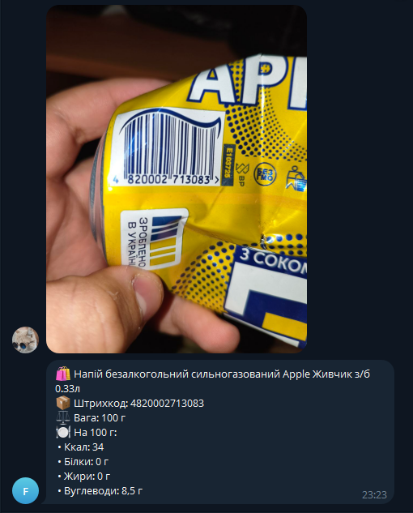

# 🥫 FoodScannerBot

Telegram-бот, який зчитує **штрихкод з фото** та показує **калорійність і БЖВ** продукту.

---

## 📸 Приклад роботи

---

## 📡 Джерело даних

Бот отримує інформацію про продукти через **[EAN-DB API](https://ean-db.com)** — глобальну базу даних товарів із штрихкодами (GTIN/EAN-13).  
API повертає назву бренду, опис, харчову цінність (калорії, білки, жири, вуглеводи) та інші метадані на 100 г/мл продукту.

---

## 🧰 Стек технологій

- **Java 17+**
- **Spring Boot**
- **TelegramBots (OkHttp client)**
- **Jackson (JSON parsing)**
- **HTTP Client (java.net.http)**
- **ZXing** — розпізнавання штрихкодів
- **GitHub Actions**
- **Docker**
